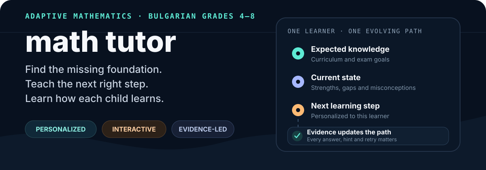
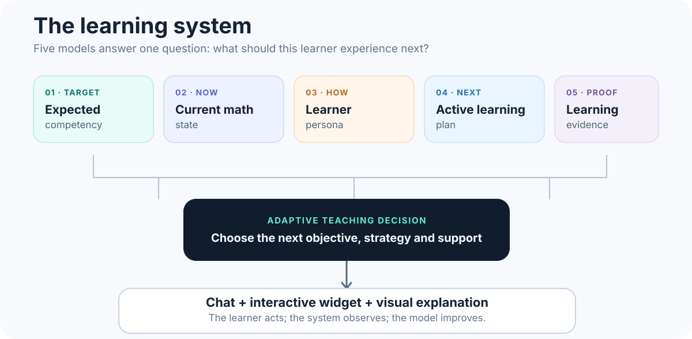

<p align="center">
  
</p>

<p align="center">
  <strong>Personalized</strong> · <strong>Interactive</strong> · <strong>Evidence-led</strong>
</p>

<p align="center">
  <a href="./docs/00-PRODUCT-VISION.md">Product vision</a> ·
  <a href="./docs/01-LEARNING-SYSTEM.md">Learning system</a> ·
  <a href="./docs/03-CURRICULUM-GRAPH.md">Curriculum graph</a> ·
  <a href="./PROJECT-STATUS.md">Project status</a>
</p>

## What this is

**Math Tutor** is a product vision for an adaptive mathematics coach aligned initially to the Bulgarian education system for **grades 4–8**.

The learner works through a simple chat interface. Instead of returning long explanations, the coach can render interactive questions, number lines, manipulatives, diagrams, step builders, exams, and short visual demonstrations directly inside the conversation.

> The chat is the container. The real product is a continuously adapting sequence of mathematical experiences selected for one specific learner.

## Why it needs to exist

A child can be enrolled in grade 7 while still missing essential foundations from much earlier grades. A normal grade-level course starts too high, repeats failure, and usually describes the result only as “weak at math.”

Math Tutor should identify something more useful:

- what the learner is expected to know;
- what the learner reliably understands now;
- which prerequisite is missing;
- which misconception is causing the error;
- which explanation or representation works best;
- what the learner should experience next.

The intended outcome is a dignified recovery path from the learner’s real starting point toward current school expectations.

## The learning system

<p align="center">
  
</p>

The system is organized around five connected models:

| Model | Question it answers |
|---|---|
| **Expected Competency** | What should the learner know according to curriculum and exam expectations? |
| **Current Mathematical State** | What is mastered, developing, missing, forgotten, or dependent on support? |
| **Learner Persona** | How does this learner understand, persist, ask for help, and respond to challenge? |
| **Active Learning Plan** | Which objective, prerequisite, review item, and strategy should come next? |
| **Learning Evidence** | What happened, and what proves that understanding or independence changed? |

Every answer, hint, retry, hesitation, representation switch, and delayed review can improve the next teaching decision.

## Learning happens through interaction

The agent should communicate with the shortest useful combination of conversation and UI:

```text
short message
+ interactive explanation
+ learner action
+ feedback
+ next action
```

Possible learning elements include:

- multiple-choice and multi-select questions;
- number lines and place-value charts;
- base-ten blocks and grouped objects;
- fraction bars and fraction builders;
- step ordering and error spotting;
- coordinate planes and geometry diagrams;
- confidence checks and guided hints;
- short animated mathematical explanations.

> Never give a paragraph when the learner can understand by touching, moving, selecting, comparing, grouping, ordering, or constructing something.

### React and Manim have different jobs

| Layer | Responsibility |
|---|---|
| **React widgets** | Let the learner select, drag, construct, compare, order, and answer. |
| **Manim Community** | Produce controlled, precise animations that explain transformations and abstract ideas. |

```text
Manim explains
→ React lets the learner act
→ the result becomes new evidence
```

## Personalization means more than difficulty

The system should adapt:

- the next mathematical objective;
- the size of each step;
- the representation used;
- the explanation length;
- the level of guidance;
- the practice format;
- the timing of review;
- the challenge level;
- the encouragement style;
- the context and examples.

Persona claims must remain evidence-backed and narrow. Prefer:

> Number lines improve decimal-magnitude performance.

Avoid broad labels such as:

> The learner is visual.

Read the full direction in [Learner Persona](./docs/02-LEARNER-PERSONA.md).

## Bulgarian grades 4–8

The initial competency graph combines several layers:

| Source layer | Role |
|---|---|
| **Bulgarian Ministry programs** | Define grade-level expectations, terminology, and learning outcomes. |
| **Grade 4 and grade 7 NVO** | Calibrate official question style, difficulty, scoring, and readiness. |
| **Marble Skill Taxonomy** | Seed foundational micro-skills and prerequisite relationships. |
| **Custom Bulgarian competency bridge** | Connect missing foundations to grade 4–8 outcomes. |
| **Original and openly licensed tasks** | Build the adaptive assessment and teaching library. |
| **Teacher review** | Validate sequencing, language, difficulty, and mathematical accuracy. |

Grade enrollment does not determine the starting point. The system should find the lowest important missing prerequisite and work upward without framing easier material as failure.

See [Curriculum Graph](./docs/03-CURRICULUM-GRAPH.md), [Assessment Library](./docs/04-ASSESSMENT-LIBRARY.md), and [Source Strategy](./docs/07-SOURCE-STRATEGY.md).

## Three governing principles

| Personalization | Simplification | Gamification |
|---|---|---|
| Adapt the path, representation, support, timing, language, and challenge. | Reduce cognitive load while preserving mathematical truth. | Reward understanding, correction, retention, persistence, and independence. |

Gamification must not create shame, speed pressure, streak anxiety, or empty engagement. Mistakes should reveal the next useful step.

## Current platform direction

These are directional choices rather than a finished technical specification:

- **Eve** — persistent teaching agent and session orchestration;
- **React + Vite** — conversational interface and trusted interactive widgets;
- **InsForge** — product data, learner state, evidence, and persistence;
- **Manim Community** — controlled mathematical animation layer;
- **Marble Skill Taxonomy** — foundational prerequisite source.

Detailed implementation follows validation of the learning model, curriculum sources, and assessment strategy.

## Documentation

| Document | Purpose |
|---|---|
| [Product Vision](./docs/00-PRODUCT-VISION.md) | Highest-level product direction and north star |
| [Learning System](./docs/01-LEARNING-SYSTEM.md) | The five models and adaptive loop |
| [Learner Persona](./docs/02-LEARNER-PERSONA.md) | Evidence-based personalization |
| [Curriculum Graph](./docs/03-CURRICULUM-GRAPH.md) | Bulgarian grades 4–8 competency direction |
| [Assessment Library](./docs/04-ASSESSMENT-LIBRARY.md) | Diagnostic, mastery, retention, transfer, and exam strategy |
| [Chat and Widget Learning](./docs/05-CHAT-AND-WIDGET-LEARNING.md) | Learning through conversation and rendered UI |
| [Manim Visual Explanations](./docs/06-MANIM-VISUAL-EXPLANATIONS.md) | Animated explanation principles |
| [Source Strategy](./docs/07-SOURCE-STRATEGY.md) | Official, open, licensed, and reference sources |
| [Gamification](./docs/08-GAMIFICATION.md) | Learning-centered motivation |
| [Current Decisions](./docs/09-DECISIONS.md) | Agreed direction and boundaries |
| [Resources](./resources/README.md) | Source catalogue and acquisition status |

## Project status

This repository is currently in the **product definition and curriculum research** phase.

Established so far:

- the product vision;
- Bulgarian grades 4–8 as the initial formal scope;
- the five-model learning system;
- the custom learner persona direction;
- chat-native interactive learning;
- Manim Community for controlled explanations;
- the official and open-source content strategy.

The next work is curriculum acquisition, grade-by-grade competency mapping, assessment classification, widget-family definition, source licensing review, and validation with a Bulgarian mathematics teacher.

Track the current state in [PROJECT-STATUS.md](./PROJECT-STATUS.md).
